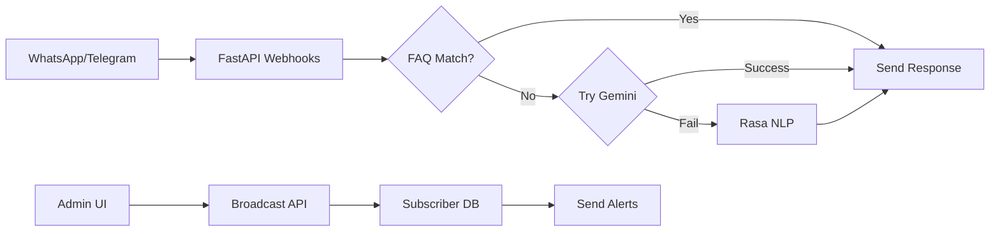

# AI Agent Instructions for Public Health Chatbot

This is a multilingual public health chatbot system designed to educate rural/semi-urban populations about healthcare, disease prevention, and vaccination through WhatsApp/Telegram. The system uses a hybrid approach combining static FAQs, Gemini, and Rasa NLP for reliable, safe responses.

## Architecture Overview

### Key Components
1. **FastAPI Backend** (`services/backend/`)
   - Handles messaging webhooks (WhatsApp Cloud API, Telegram)
   - Manages subscriber database and broadcast alerts
   - Uses tiered response strategy: FAQ → Gemini → Rasa fallback
   - Key files: `app/main.py`, `app/messaging_utils.py`, `app/faqs.py`

2. **Rasa NLP Engine** (`services/rasa/`)
   - Multilingual intent classification (EN/HI/OD)
   - Uses DIETClassifier with character n-grams
   - Conservative fallback threshold (0.3) for safety
   - Supports transliterated queries (e.g., "dengue ke lakshan")
   - Key files: `config.yml`, `domain.yml`, `data/nlu.yml`

3. **React Dashboard** (`services/frontend/`)
   - TypeScript + Vite + Tailwind CSS
   - Real-time analytics and broadcast management
   - Dark mode ready, WCAG AA compliant
   - Key files: `src/pages/Dashboard.tsx`, `src/components/`

### Data Models
1. **Outbreak Alert**:
```json
{
  "region": "string",    // Geographic region name
  "disease": "string",   // Disease identifier
  "severity": "low|medium|high",
  "advice": "string"     // Public health guidance
}
```

2. **Subscriber**:
```python
{
    "phone": "string",      # WhatsApp/Telegram ID
    "language": "string"    # en|hi|or (English|Hindi|Odia)
}
```

### Data Flows


## Development Workflow

### Local Setup
1. Start Rasa (2 terminals):
```bash
cd services/rasa
python -m venv .venv && .venv/Scripts/activate
pip install -r requirements.txt
rasa train
rasa run --enable-api --cors "*" -p 5005  # Terminal 1
rasa run actions -p 5055                   # Terminal 2
```

2. Start Backend:
```bash
cd services/backend
python -m venv .venv && .venv/Scripts/activate
pip install -r requirements.txt
uvicorn app.main:app --reload --port 8000
```

3. Start Frontend:
```bash
cd services/frontend
npm install
npm run dev
```

### Docker Setup
```bash
docker compose up --build
```

## Key Patterns & Conventions

### Multilingual Support
- NLU training data includes English, Hindi (Devanagari), and Odia scripts
- Support transliterated queries (e.g., "dengue ke lakshan")
- Language-specific response templates in Rasa domain.yml
- Example in `services/rasa/data/nlu.yml`:
```yaml
- intent: ask_symptoms
  examples: |
    - What are the symptoms of [dengue](disease)?
    - dengue ke lakshan kya hai
    - डेंगू के लक्षण
    - ଡେଙ୍ଗୁର ଲକ୍ଷଣ
```

### Response Handling
- All health advice MUST include disclaimers
- Use tiered response strategy (FAQ → Gemini → Rasa)
- Messages are processed asynchronously via background tasks
- Example in `services/backend/app/main.py`:
```python
async def _handle_message_and_reply(sender: str, message: str, channel: str):
    answer = find_faq_answer(message) or await ask_gemini(message) or await ask_rasa(message)
```

### Frontend Components
- Use TypeScript for all new components
- Wrap charts in `Card` component for consistent styling
- Follow existing dark mode patterns with `className="dark:bg-gray-800"`
- Example in `services/frontend/src/components/`:
```tsx
<Card title="Stats">
  <h3 className="text-2xl font-bold dark:text-white">{value}</h3>
</Card>
```

### Testing & Safety
- Run Rasa tests before pushing NLU changes
- Test broadcasts with small subscriber groups first
- Validate all health-related content with domain experts
- Keep fallback threshold high (0.3) for safer responses
- Use mock outbreak data for testing: `data/mock_outbreaks.json`

## Configuration
- Environment variables in `services/backend/.env`:
  - `WHATSAPP_CLOUD_TOKEN`: Meta WhatsApp API token
  - `TELEGRAM_BOT_TOKEN`: Telegram bot credentials
  - `RASA_BASE_URL`: Rasa server endpoint (default: http://localhost:5005)
  - `GEMINI_API_KEY`: Google Gemini API key (optional)

## Troubleshooting
1. **FAQ not matching**: Check `faqs.py` for keyword mapping
2. **Rasa errors**: Verify both Rasa main and actions servers are running
3. **Language issues**: Check `nlu.yml` for sufficient examples in that language
4. **Broadcast failures**: Validate subscriber phone numbers format