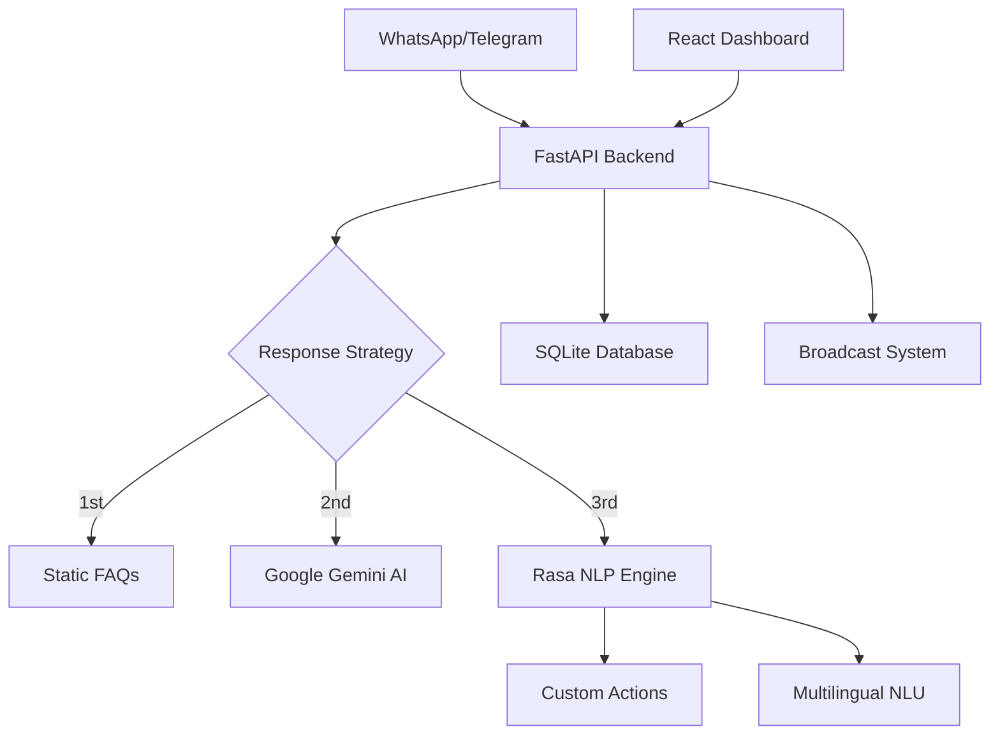

# AI-Driven Public Health Chatbot for Disease Awareness

**Organization:** Government of Odisha  
**Department:** Electronics & IT Department  
**Category:** Software  
**Theme:** MedTech / BioTech / HealthTech  
**PSID:** 25049

## 🎯 Problem Statement

Create a multilingual AI chatbot to educate rural and semi-urban populations about preventive healthcare, disease symptoms, and vaccination schedules. The chatbot integrates with government health databases and provides real-time alerts for outbreaks.

### 📊 Expected Outcomes
- ✅ Chatbot accessible via WhatsApp/Telegram
- ✅ Target ≥80% accuracy on health Q&A with safety disclaimers
- ✅ Increase awareness by ≥20% in target communities
- ✅ Multilingual support (English/Hindi/Odia)

## 🏗️ Architecture Overview



### 🔧 Tech Stack
- **Backend:** FastAPI + SQLite + Python 3.11
- **NLP Engine:** Rasa OSS 3.6.2 + Custom Actions
- **AI Integration:** Google Gemini API
- **Frontend:** React 18 + TypeScript + Tailwind CSS
- **Messaging:** WhatsApp Cloud API + Telegram Bot API
- **Deployment:** Docker Compose

## 🚀 Quick Start

### Prerequisites
- Docker & Docker Compose
- Node.js 18+ (for local development)
- Python 3.11+ (for local development)

### 1. Environment Setup

```bash
# Clone repository
git clone <repository-url>
cd ai_public_health_chatbot_whatsapp_telegram

# Copy environment files
cp services/backend/.env.example services/backend/.env
```

### 2. Configure API Keys

Edit `services/backend/.env`:
```env
# Required for AI responses
GEMINI_API_KEY=your_gemini_api_key_here

# Required for WhatsApp
WHATSAPP_PHONE_NUMBER_ID=your_phone_number_id
WHATSAPP_CLOUD_TOKEN=your_whatsapp_token

# Required for Telegram
TELEGRAM_BOT_TOKEN=your_telegram_bot_token

# Internal services (auto-configured in Docker)
RASA_BASE_URL=http://rasa:5005
BACKEND_HOST=http://backend:8000
```

### 3. Deploy with Docker

```bash
# Build and start all services
docker compose up --build

# Or run in background
docker compose up -d --build
```

### 4. Access Services

- **Frontend Dashboard:** http://localhost
- **Backend API:** http://localhost:8000
- **API Documentation:** http://localhost:8000/docs
- **Rasa Server:** http://localhost:5005

## 📱 Messaging Integration

### WhatsApp Setup
1. Create Meta Developer account
2. Set up WhatsApp Business API
3. Configure webhook: `https://your-domain.com/webhook/whatsapp`
4. Add phone number ID and access token to `.env`

### Telegram Setup
1. Create bot with @BotFather
2. Set webhook: 
   ```bash
   curl -X POST "https://api.telegram.org/bot<TOKEN>/setWebhook" \
        -d "url=https://your-domain.com/webhook/telegram"
   ```
3. Add bot token to `.env`

## 🗂️ Project Structure

```
ai_public_health_chatbot/
├── 📁 services/
│   ├── 📁 backend/           # FastAPI application
│   │   ├── 📁 app/
│   │   │   ├── main.py       # Main FastAPI app
│   │   │   ├── db.py         # Database models
│   │   │   ├── faqs.py       # FAQ + Gemini integration
│   │   │   ├── messaging_utils.py # WhatsApp/Telegram
│   │   │   └── models.py     # Pydantic schemas
│   │   └── requirements.txt
│   ├── 📁 rasa/             # NLP Engine
│   │   ├── 📁 data/         # Training data
│   │   ├── 📁 actions/      # Custom actions
│   │   ├── config.yml       # Pipeline config
│   │   ├── domain.yml       # Bot domain
│   │   └── requirements.txt
│   └── 📁 frontend/         # React Dashboard
│       ├── 📁 src/
│       │   ├── 📁 pages/    # Dashboard pages
│       │   ├── 📁 components/ # Reusable components
│       │   └── main.tsx     # App entry point
│       └── package.json
├── 📁 data/                 # Static data
│   └── mock_outbreaks.json  # Sample outbreak data
├── 📁 vaccines/             # Vaccination schedules
│   └── vaccine_schedule.json
├── docker-compose.yml       # Multi-service deployment
└── README.md               # This file
```

## 🔄 Development Workflow

### Local Development

1. **Start Rasa Services:**
```bash
cd services/rasa
python -m venv .venv
source .venv/bin/activate  # Linux/Mac
# OR .venv\Scripts\activate  # Windows

pip install -r requirements.txt
rasa train

# Terminal 1: Rasa server
rasa run --enable-api --cors "*" -p 5005

# Terminal 2: Rasa actions
rasa run actions -p 5055
```

2. **Start Backend:**
```bash
cd services/backend
python -m venv .venv
source .venv/bin/activate

pip install -r requirements.txt
uvicorn app.main:app --reload --port 8000
```

3. **Start Frontend:**
```bash
cd services/frontend
npm install
npm run dev
```

### Testing

```bash
# Test Rasa NLU
cd services/rasa
rasa test nlu

# Test backend endpoints
curl -X GET http://localhost:8000/health

# Test chat functionality
curl -X POST http://localhost:8000/ask \
  -H "Content-Type: application/json" \
  -d '{"question": "What are dengue symptoms?"}'
```

## 🌐 Multilingual Support

The chatbot supports three languages:
- **English (en):** Primary language
- **Hindi (hi):** Devanagari script + transliterated queries
- **Odia (or):** Regional language for Odisha

### Example Queries
```
English: "What are dengue symptoms?"
Hindi: "डेंगू के लक्षण क्या हैं?"
Transliterated: "dengue ke lakshan kya hai"
Odia: "ଡେଙ୍ଗୁର ଲକ୍ଷଣ କଣ?"
```

## 📊 Features

### ✅ Implemented
- [x] Multi-channel messaging (WhatsApp + Telegram)
- [x] Hybrid AI response system (FAQ → Gemini → Rasa)
- [x] Multilingual NLP with transliteration support
- [x] Subscriber management system
- [x] Broadcast alert system
- [x] Real-time dashboard with analytics
- [x] Vaccination schedule lookup
- [x] Disease outbreak alerts
- [x] Docker containerization

### 🚧 In Progress
- [ ] Advanced analytics and reporting
- [ ] Integration with government health APIs
- [ ] Voice message support
- [ ] SMS fallback integration

### 📋 Planned
- [ ] Machine learning model for outbreak prediction
- [ ] Integration with hospital management systems
- [ ] Mobile app for health workers
- [ ] Advanced user segmentation

## 🔒 Safety & Compliance

- **Medical Disclaimers:** All health advice includes safety disclaimers
- **Fallback Threshold:** Conservative 0.3 threshold for Rasa responses
- **Data Privacy:** Local SQLite database, no external data sharing
- **Content Validation:** All health content reviewed by domain experts

## 🚀 Deployment

### Production Deployment

1. **Set up domain and SSL:**
```bash
# Configure your domain to point to server
# Set up SSL certificate (Let's Encrypt recommended)
```

2. **Environment variables:**
```bash
# Production .env
GEMINI_API_KEY=prod_key
WHATSAPP_CLOUD_TOKEN=prod_token
TELEGRAM_BOT_TOKEN=prod_token
```

3. **Deploy with Docker:**
```bash
docker compose -f docker-compose.prod.yml up -d
```

### Health Checks

All services include health check endpoints:
- Backend: `GET /health`
- Rasa: `GET /health` (port 5005)
- Frontend: HTTP 200 on root path

## 📈 Monitoring & Analytics

The dashboard provides:
- **Real-time Metrics:** Active users, message volume
- **Engagement Analytics:** Response rates, popular queries
- **Health Insights:** Disease trends, vaccination coverage
- **System Health:** Service status, response times

## 🤝 Contributing

1. Fork the repository
2. Create feature branch: `git checkout -b feature/amazing-feature`
3. Commit changes: `git commit -m 'Add amazing feature'`
4. Push to branch: `git push origin feature/amazing-feature`
5. Open Pull Request

## 📄 License

This project is developed for Government of Odisha under PSID 25049.

## 🆘 Support

For technical support or questions:
- Create an issue in the repository
- Contact the development team
- Check the troubleshooting section in STATUS.md

---

**Built with ❤️ for public health awareness in Odisha**